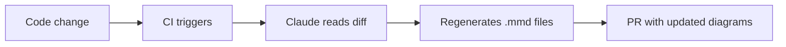
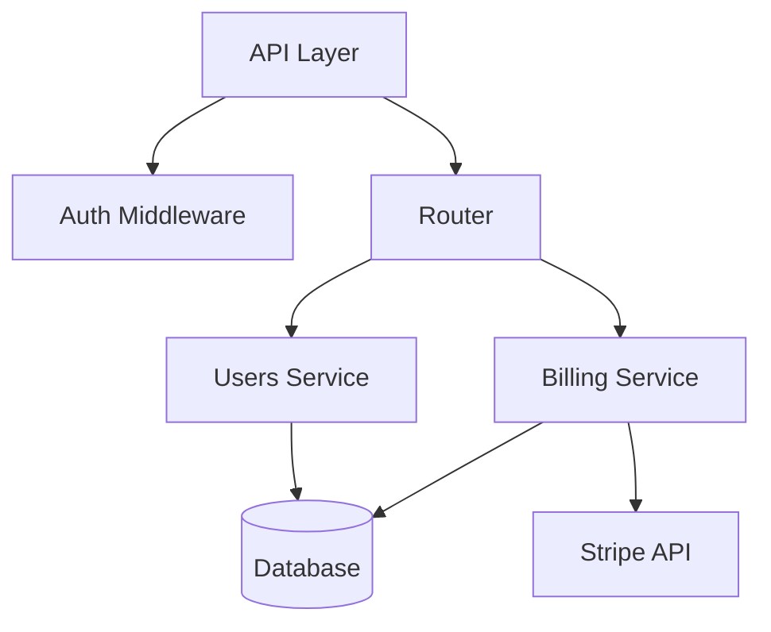

# Generating diagrams with AI

Documentation diagrams go stale the moment code changes. Mermaid lets you define diagrams as code — and AI can keep them in sync.



---

# Why mermaid?

- **Text-based** — Lives in version control alongside your docs
- **Diffable** — Reviewers see exactly what changed in a diagram
- **Renderable everywhere** — GitHub, Docusaurus, GitLab, Notion all render it natively
- **AI-friendly** — LLMs can read and write it fluently

No more exporting PNGs from draw.io and hoping someone updates them.

---

# Keeping diagrams accurate

The key insight: **regenerate diagrams programmatically on code diffs.**

A CI hook or Claude Code hook can:

1. Detect which source files changed
2. Read the relevant code context
3. Regenerate the `.mmd` diagram files that depend on that code
4. Include the updated diagrams in the same PR

```yaml
# .claude/hooks/post-edit.sh
# After editing source files, regenerate related diagrams
claude -p "The following files changed: $CHANGED_FILES.
  Update any .mmd diagram files in docs/ that
  reference the changed modules."
```

---

# What this looks like in practice

An architecture diagram that stays in sync with your actual module structure:



When someone adds a new service or changes a dependency, the diagram updates automatically in the same PR — no manual editing needed.

---

# The prompt that drives it

You don't need complex tooling. A well-scoped prompt does the work:

```
Read the module imports in src/ and update
docs/architecture.mmd to reflect the current
dependency graph. Only include top-level modules.
Keep the layout direction as TD (top-down).
Preserve any manual annotations marked with
%% keep comments.
```

Claude reads the code, understands the structure, and outputs valid mermaid syntax. The diagram is always one `git diff` away from being verified.
